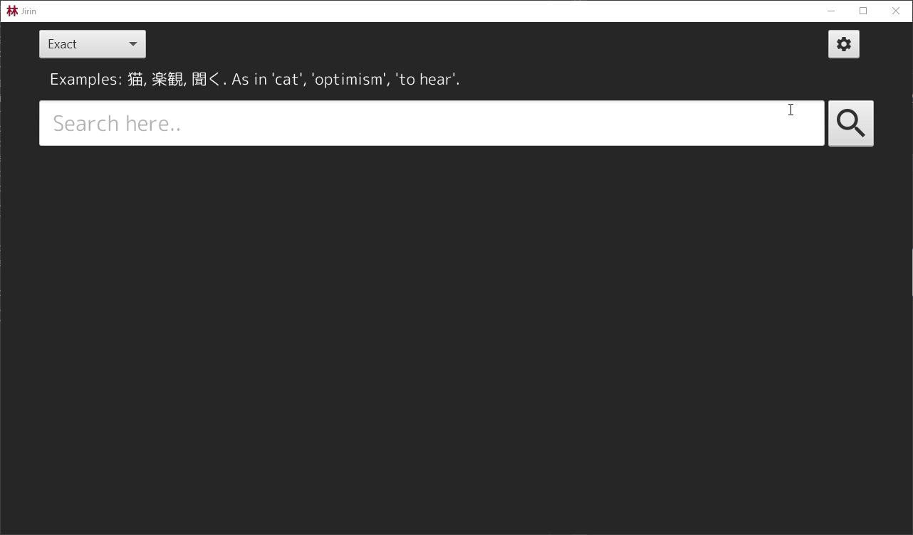

# Jirin Dictionary
A Java application for searching and parsing online monolingual Japanese dictionaries. Initially support only for [goo辞典](https://dictionary.goo.ne.jp/). The name comes from the lesser used Japanese word for dictionary, 辞林.

Current state of the UI:  


## Releases
* [Week 7](https://github.com/Luukuton/ot-harjoitustyo-hy2020/releases/tag/week7) (latest)
* [Week 6](https://github.com/Luukuton/ot-harjoitustyo-hy2020/releases/tag/week6)
* [Week 5](https://github.com/Luukuton/ot-harjoitustyo-hy2020/releases/tag/week5)

## Documentation
* [User guide](documentation/user_guide.md)
* [Software requirements specifications](documentation/software_requirements_specification.md)
* [Architecture](documentation/architecture.md)
* [Testing](documentation/testing.md)
* [Time accounting](documentation/time_accounting.md)

## Running

The application can be run with: 
```
mvn compile exec:java -Dexec.mainClass=fi.luukuton.jirin.Main
```

## Testing

Tests can be performed with: 
```
mvn test
```

Automatic testing requires an internet connection as it utilizes an online dictionary.

Code coverage can be created with: 
```
mvn jacoco:report
```

Code coverage can be viewed by opening _target/site/jacoco/index.html_ in a browser.

## Generating a JAR file

Following command: 
```
mvn package
```
generates a runnable JAR file, _jirin-1.5-SNAPSHOT.jar_, to the _target_ directory.

## JavaDoc

JavaDoc files can be created with: 
```
mvn javadoc:javadoc
```

They can be viewed by opening _target/site/apidocs/index.html_ in a browser.

## CheckStyle

Checks defined in [checkstyle.xml](checkstyle.xml) can be executed with: 
```
mvn jxr:jxr checkstyle:checkstyle
```

Results can be viewed by opening _target/site/checkstyle.html_ in a browser.


## Dependencies
* Java 11+
* Maven 

