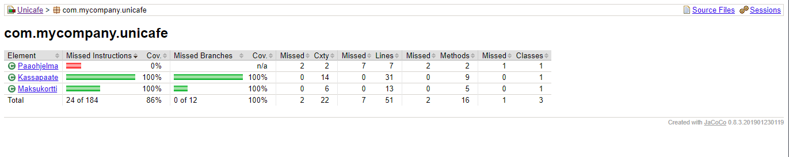

# Jirin
A Java application for searching and parsing online monolingual Japanese dictionaries. Initially support only for [goo辞典](https://dictionary.goo.ne.jp/). The name comes from the lesser used Japanese word for dictionary, 辞林.

Software requirements specifications [here](documentation/software_requirements_specification.md).

Time accounting for the project [here](documentation/time_accounting.md).

## Exercises
### Week 1
* [gitlog.txt](laskarit/viikko1/gitlog.txt)
* [komentorivi.txt](laskarit/viikko1/komentorivi.txt)

### Week 2

## Dependancies
* Java 11

## Test area
foo bar ほげ
