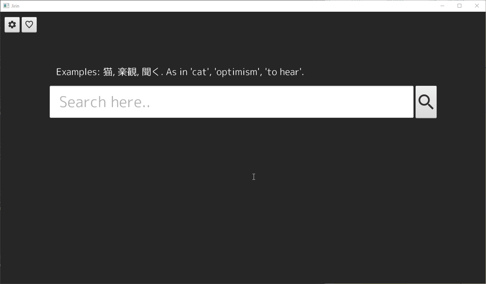

# Jirin
A Java application for searching and parsing online monolingual Japanese dictionaries. Initially support only for [goo辞典](https://dictionary.goo.ne.jp/). The name comes from the lesser used Japanese word for dictionary, 辞林.

Current state of the UI:  
 

## Documentation
- [Software requirements specifications](documentation/software_requirements_specification.md)
- [Architecture](documentation/architecture.md)
- [Time accounting](documentation/time_accounting.md)

## Running

The application can be run with: 

```
mvn compile exec:java -Dexec.mainClass=jirin.Main
```

## Testing

Tests are performed with: 

```
mvn test
```

Code coverage is created with: 

```
mvn jacoco:report
```

Code coverage can be viewed by opening _target/site/jacoco/index.html_ in a browser.

## Generating JAR file

Following command 

```
mvn package
```

generates a runnable JAR file, _jirin-1.0-SNAPSHOT.jar_, to the _target_ directory.

## JavaDoc

JavaDoc files are created with: 

```
mvn javadoc:javadoc
```

They can be viewed by opening _target/site/apidocs/index.html_ in a browser.

## Dependancies
* Java 11

