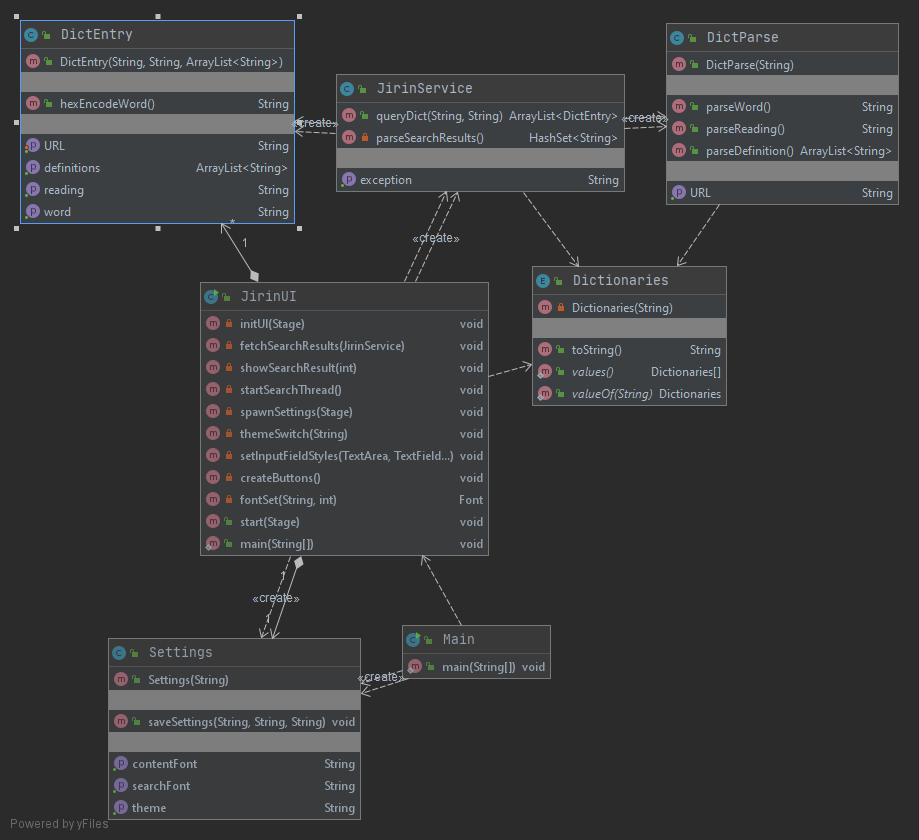

# Architecture
## Software logic
Functionality is managed by JirinService and DictParse classes. The main data model is the DictEntry class. Dictionary domains are stored inside the Dictionaries enumeration.

### DictEntry
DictEntry is a class for one word, its reading and its definitions. The class also has the ability to convert the word to a hex for URLs.

### JirinService 
JirinService acts like a bridge between the UI and the main functionality class DictParse. It parses search results page (`https://dictionary.goo.ne.jp/srch/jn/<word>/<mode>`) and passes any found links (`https://dictionary.goo.ne.jp/<category>/<entry>`) to DictParse.

It also returns any errors occurred during the parsing.

* Word examples: 
  * 猫, 楽観, 聞く, ふらふら, transparent
* Possible modes:
  * `m0u` "forward", starts with these characters
  * `m1u` "exact", exactly this
  * `m2u` "backward", ends with these characters
  * `m3u` somewhere in the definition or explanation
  * `m4u` same as m0u 
  * `m5u` same as m0u 
  * `m6u` somewhere in the word or title
  
Currently, Jirin utilizes three of these modes: m0u, m1u and m2u. 

### DictParse
DictParse includes the core functionality of this application. It is responsible for parsing specific entries on this free online Japanese to Japanese dictionary website: https://dictionary.goo.ne.jp/. 

Example urls: 

`https://dictionary.goo.ne.jp/word/<word in hex>`
`https://dictionary.goo.ne.jp/word/kanji/<word in hex>`

### Dictionaries
Dictionaries enumeration stores all dictionary domains in it, which then can be used to access them where needed. 

JirinService needs them for searching the user input. DictParse needs them for accessing specific entries for words and phrases and lastly, JirinUI needs them for displaying the source link.

Dictonaries currently:
* [goo辞典](https://dictionary.goo.ne.jp)

## Sequence diagram

## Graphical User Interface
There are two Scenes in the GUI: Main window and Settings.

The main scene is made of one VBox which consists of two GridPanes:
* header
  * 2 Buttons for settings and search
  * 1 ComboBox for selecting the search mode (exact, forward, backward)
  * 2 TextFields for the search bar and the help tip
  * 1 HyperLink for the web source link (leads to the source page of the word)
* content
  * 1 TextField for result title or error messages
  * 1 TextArea for the rest of the result
  * 2 Buttons for going forward and backward in results (if there are multiple)

In addition, the main scene's VBox is inside a StackPane which is used to display the loading icon on top of everything when searching.

The settings scene is made of one GridPane: 
* 3 ComboBoxes with labels for theme and two fonts
* 2 Buttons for confirming (checkmark) and cancelling (cross)
* 1 Label for a notice

The UI uses Google Fonts and Google's Material Design icons. Appropriate licenses can be found inside the resource directory.

## Weaknesses
The JirinUI class is somewhat long and complex. It should be mostly refactored into FXML in the future. 

One CheckStyle violation in JirinService class in its function _queryDict_ which is over 20 lines (31). I feel that this is justified because the exception catching takes up ten lines in addition to the logic.
