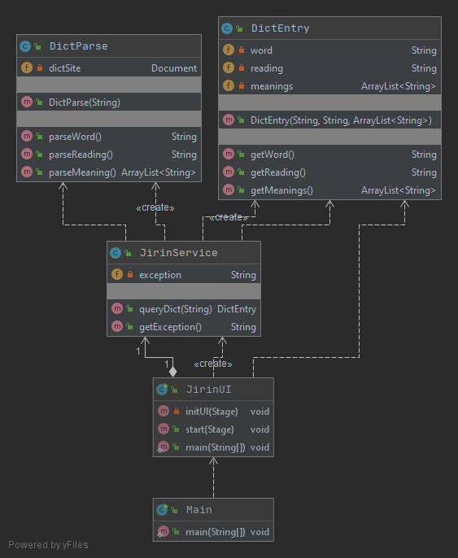
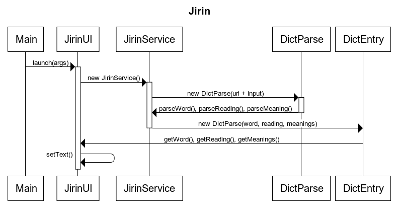

# Architecture
## Software logic
Functionality is managed by JirinService and DictParse classes and the main data model is the DictEntry class.

### DictEntry
DictEntry is a class for one word, its reading and its meanings. The class also has the ability to convert the word to a hex for URLs.

### JirinService 
JirinService acts like a bridge between the UI and the main functionality class DictParse. It parses search results page (https://dictionary.goo.ne.jp/srch/jn/楽観/m0u) and passes found links (https://dictionary.goo.ne.jp/word/楽観/) to DictParse.
 
It also returns any errors occured during the parsing.

### DictParse
DictParse includes the core functionality of this application. It is responsible for parsing this free online Japanese to Japanese dictionary website: https://dictionary.goo.ne.jp/. 

More specifically it takes the user input and selected mode, which are passed by the JirinService class, and loads the website for the search results: `https://dictionary.goo.ne.jp/srch/jn/<word>/<mode>`.
* Word examples: 
  * 猫, 楽観, 聞く, ふらふら, transparent
* Possible modes:
  * `m0u` "forward", starts with these characters
  * `m1u` "exact", exactly this
  * `m2u` "backward", ends with these characters
  * `m3u` somewhere in the meaning or explanation
  * `m4u` same as m0u 
  * `m5u` same as m0u 
  * `m6u` somewhere in the word or title
  
Currently, Jirin only utlizies three modes: m0u, m1u and m2u.

## Sequence diagram

## Graphical User Interface
There are currently three Scenes in the GUI
* Main window
* Settings
* Favorites (WIP)

The main scene is made of one VBox which consists of two GridPanes:
* header
  * 2 Buttons for settings, favorites
  * 1 ComboBox for selecting the search mode (exact, forward, backward)
  * 1 HyperLink for the source link (leads to the source page of the word)
* content
  * 4 TextFields for the search bar, tip, error messages and result title
  * 1 TextArea for the rest of the result
  * 1 Button for the search button
  
The settings scene is made of one GridPane: 
* 3 ComboBoxes with labels for theme and two fonts
* 2 Buttons for confirming and cancelling
* 1 Label for notice

The GUI uses Google Fonts and Google's Material Design icons. Appropriate licenses can be found inside the resource directory.

## Weaknesses
The JirinUI class is somewhat long and complex. Should be mostly refactored into FXML in the future.
