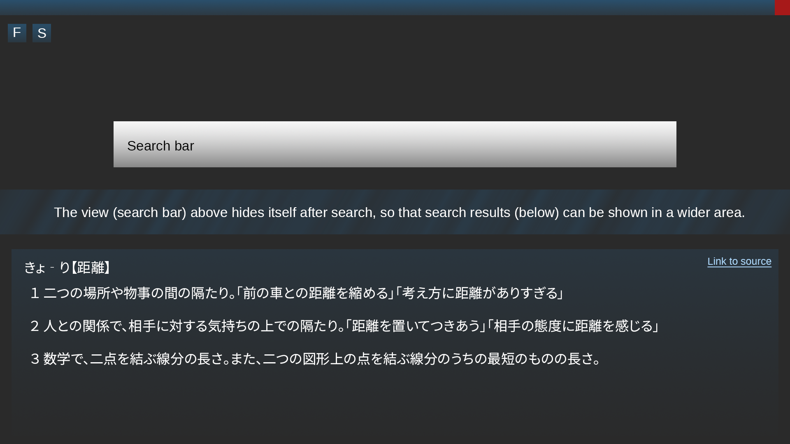

# Software requirements specification
## Purpose of the application
With this application, users can search Japanese definitions for Japanese words or proverbs through a online monolingual dictionary called [goo辞典](https://dictionary.goo.ne.jp) (goo dictionary). Users can also save words or proverbs as favorites.

## Interface
The application features a single (responsive) main view, where users can search for words. Additionally there's a settings view, where users can change some basic settings such as theme.

A draft of the interface: 

F as in Favorites and S as in Settings.

## Functionality
- [x] Clean UI
- [x] Search words or proverbs through a search bar (returns word, reading, meanings)
- [x] Customize the application through some basic settings (font, theme etc.)
- [ ] Open up the source webpage through a link
- [ ] Different search modes ("starts with", "ends with", "exact")
- [ ] Save search results as favorites to a database
 
## Ideas for future
 * More search modes such as "includes"
 * Support for local dictionaries
 * Support for multiple online dictionaries
 * A mobile version (Android, iOS)
 