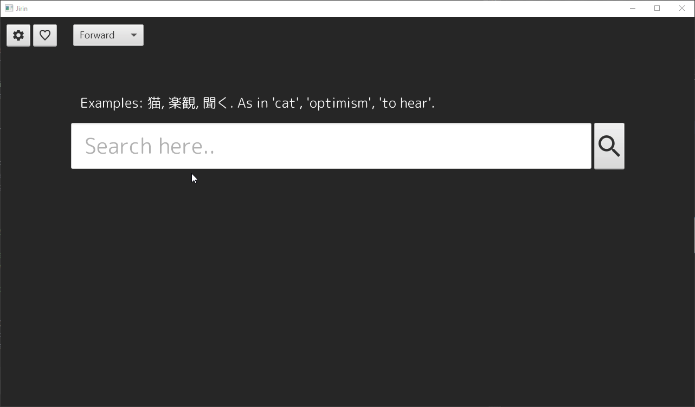

# Software requirements specification
## Purpose of the application
With this application, users can search J§apanese definitions for Japanese words or proverbs through an online monolingual dictionary called [goo辞典](https://dictionary.goo.ne.jp) (goo dictionary). Users can also save words or proverbs as favorites.

## Interface
The application features a single (responsive) main view, where users can search for words. Additionally, there's a settings view, where users can change some basic settings such as theme and fonts.

Interface currently: 

## Functionality
- [x] Clean UI
- [x] Search words or proverbs through a search bar (returns word, reading, definitions)
- [x] Different search modes ("exact", "forward", "backward")
- [x] Searching can return multiple responses
- [x] Customize the application through some basic settings (font, theme)
- [x] Open up the source web page through a link

## Ideas for future
 * More search modes such as "includes" and "includes in definition"
 * Support for local dictionaries
 * Support for multiple online dictionaries
 * A mobile version (Android, iOS)
 