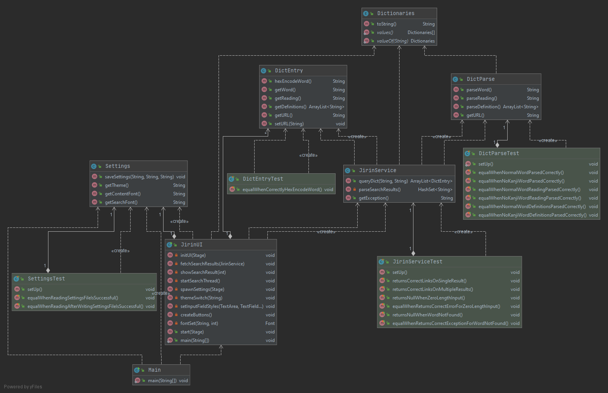
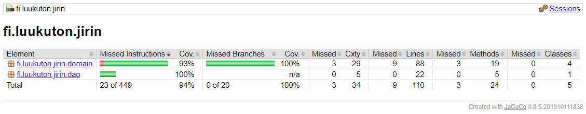

# Testing document
## Automatic testing (JUnit4)
**Automatic testing requires an internet connection as it utilizes an online dictionary.**

### Application logic
Application logic ([fi.luukuton.jirin.domain](../src/main/java/fi/luukuton/jirin/domain)), or in other words: the core of the application, is tested with three test classes:
##### DictParseTest
[DictParseTest](../src/test/java/fi/luukuton/jirin/domain/DictParseTest.java) tests that word, its reading and definitions are all parsed correctly into Strings in two cases: when the word has the same reading as it's written (no kanji form) and when they are different (kanji form).

##### JirinServiceTest
[JirinServiceTest](../src/test/java/fi/luukuton/jirin/domain/JirinServiceTest.java) tests for two different error situations with user input: 'zero length input' and 'search term not found'. It also tests for two different cases of found results, _single_ result and _multiple_ results, as the behaviour of the application changes based on that.

##### DictEntryTest
[DictEntryTest](../src/test/java/fi/luukuton/jirin/domain/DictEntryTest.java) is testing that characters are being correctly encoded into hex. 

### DAO
The only DAO class ([fi.luukuton.jirin.dao.Settings](../src/main/java/fi/luukuton/jirin/dao/Settings.java)) is tested with one test class: 

##### SettingsTest
[SettingsTest](../src/test/java/fi/luukuton/jirin/dao/SettingsTest.java) tests that reading and writing of the settings.properties files is successful.

### UI
The UI ([fi.luukuton.jirin.ui](../src/main/java/fi/luukuton/jirin/ui)) isn't tested. 

## Test coverage
Main class (creates the settings.properties file if doesn't exist and launches the app) and user interface ([fi.luukuton.jirin.ui](../src/main/java/fi/luukuton/jirin/ui) are excluded from this report.

Test coverage is 94% and branch coverage is 100%.

A couple exceptions, when there's no internet connection or if the host not available or blocked for some reason, aren't being tested. Also, getters and setters which simply access or save data, aren't being tested. 

## System testing
System testing has been done manually.

The application has been tested as described in the [user guide](user_guide.md) in Windows 10, Arch Linux, and Cubbli Linux environments. 

All functionality specified in the [software requirements specification](software_requirements_specification.md) has also been tested thoroughly, not forgetting any error situations.
