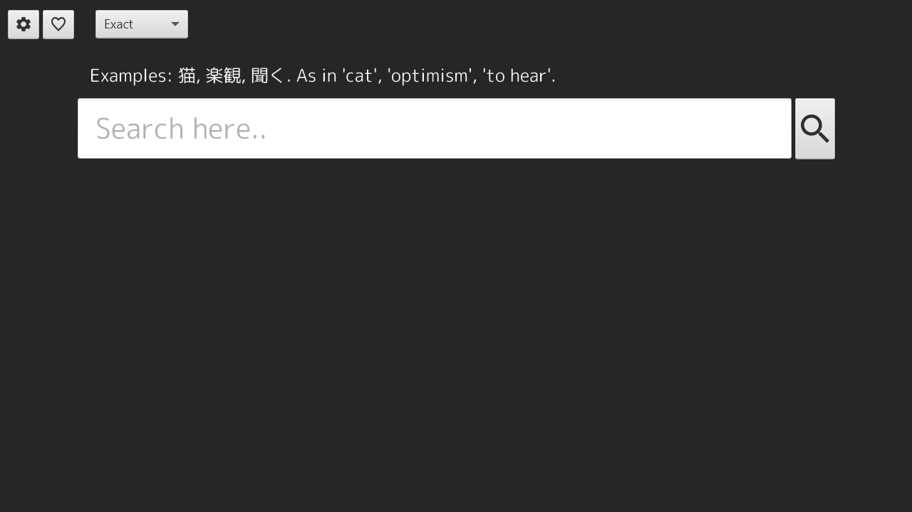
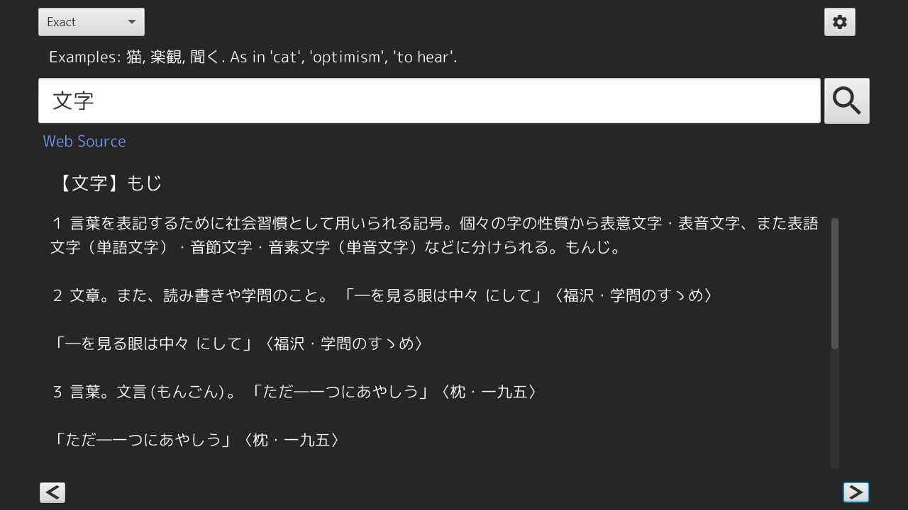
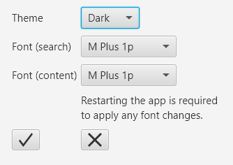

# User guide
Download the newest release in [releases](https://github.com/Luukuton/ot-harjoitustyo-hy2020/releases).

## Launching the application
The application can be launched by clicking the .jar file depending on the OS or entering the following command: 
```
java -jar jirin.jar
```

## Configuration
If the config file (settings.properties) is not present in the same folder as the jar, it will be generated on launch.

The config can be changed through settings (gear icon) inside the app.

## Searching
Application launches to this view: 



Search queries can be made by typing into the search bar and pressing enter or clicking the magnifier. Search mode can be changed by selecting one from the list.

There are three different search modes: 
* Exact
  * Query is this exact string typed into the search bar.
  * For example when searching '走る', it'll only match '走る'.
* Forward
  * Query begins with these characters. 
  * For example when searching '疑', it'll match '疑問', '疑念', '疑惑' etc.
  * In regex it'd be `/疑.*/`.
* Backward
  * Query ends with these characters. 
  * For example when searching '気', it'll match '空気', '元気', '天気' etc.
  * In regex it'd be `/.*気/`.



Settings view: 


